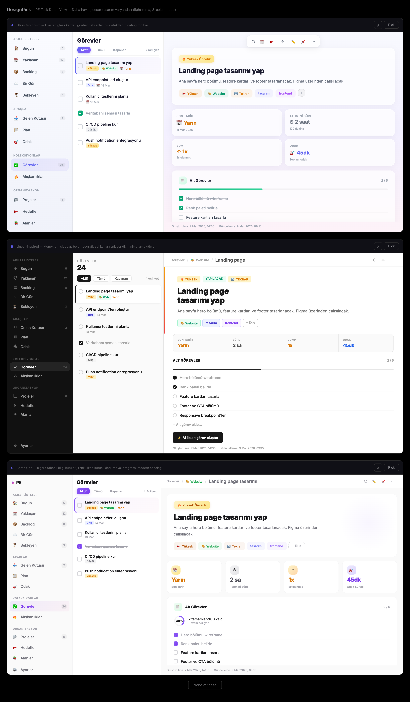

# designpick

Visual design comparison tool for AI coding agents. When an AI generates multiple UI variants, designpick renders them side-by-side and lets you pick your favorite — directly from your terminal.



## How it works

1. AI agent generates 2–8 HTML design variants
2. designpick opens a browser UI showing all variants side-by-side
3. You compare, select your favorite, and optionally leave feedback
4. The selected variant's HTML is returned to the AI agent

## Quick Start

### 1. Clone & build

```bash
git clone https://github.com/Haknt/designpick.git
cd designpick
npm install
npm run build
```

### 2. Add to Claude Code

Open (or create) `~/.claude/.mcp.json` and add:

```json
{
  "mcpServers": {
    "designpick": {
      "command": "node",
      "args": ["/absolute/path/to/designpick/dist/index.js"]
    }
  }
}
```

> Replace `/absolute/path/to/designpick` with the actual path where you cloned the repo.

### 3. Restart Claude Code

Close and reopen Claude Code. You should see `designpick` in your available MCP tools. That's it!

## Example Prompts

Try these with Claude Code to see designpick in action:

### Landing Page

> "Design 3 different hero section variants for a SaaS landing page and let me compare"

### Component Design

> "Create a pricing card component — one minimal, one with a gradient, one glassmorphism. Let me pick."

### Dark vs Light

> "Build a settings page in both dark and light themes, show me side by side"

### Layout Exploration

> "Show me 4 different dashboard layouts: sidebar nav, top nav, minimal, and dense. Let me choose."

### Mobile First

> "Design a mobile bottom navigation bar — 3 variants with different icon styles and animations"

### A/B Testing

> "I need two versions of a signup form — one single-page, one multi-step wizard. Let me compare."

### Redesign

> "Here's my current navbar code: [paste code]. Redesign it in 3 different styles and let me pick."

## Comparison UI Features

When designpick opens in your browser, you can:

- **Preview** each variant in a live HTML iframe
- **Select** your preferred variant with one click
- **Dislike** variants you don't want (AI learns your taste)
- **Leave feedback** to guide the AI's next iteration
- **Reject all** if none of the variants work — AI will try again

## How the feedback loop works

```
You: "Design a card component, 3 variants"
        ↓
Claude generates 3 HTML variants
        ↓
designpick opens in browser → you pick Variant B + leave feedback: "love the shadow, make corners sharper"
        ↓
Claude receives your selection + feedback → refines the design
        ↓
You get exactly the design you want
```

## API Reference

### Tool: `designpick_compare`

| Parameter | Type | Required | Description |
|-----------|------|----------|-------------|
| `variants` | array (2–8) | yes | Design variants to compare |
| `variants[].label` | string | yes | Short label (e.g. "A", "B") |
| `variants[].html` | string | yes | Complete self-contained HTML |
| `variants[].description` | string | no | One-line summary of the variant's approach |
| `description` | string | no | What is being compared |

### Return value

The tool returns the **selected variant's full HTML** along with:
- Which variant was selected (label + description)
- Which variants were disliked
- User's free-text feedback

## License

MIT
